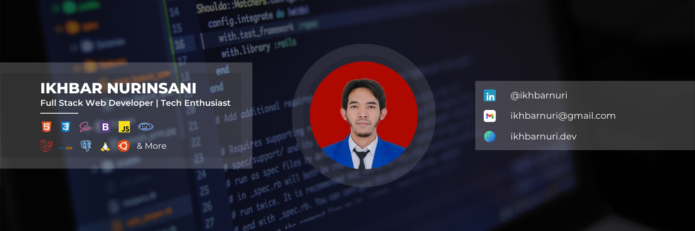

## Hi there! 👋

My name is Ikhbar Nurinsani and I'm a Full Stack Web Developer from Indonesia.

- 🔭 I’m currently working on [@ict-ummi](https://github.com/ict-ummi)
- 🌱 I’m currently learning [**Laravel**](https://laravel.com) Framework with [**Filament**](https://filamentphp.com)

#### Skills

                  

#### Connect With Me

  

#### My Github Stats

  

    
  

  

    
  

